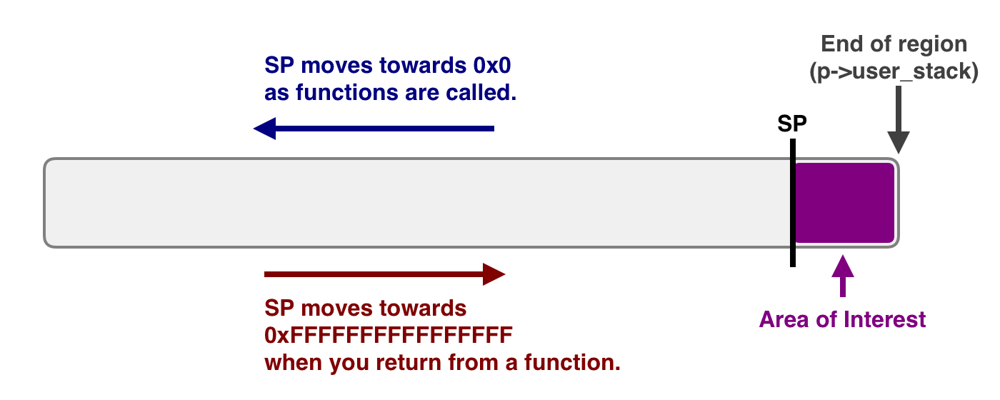
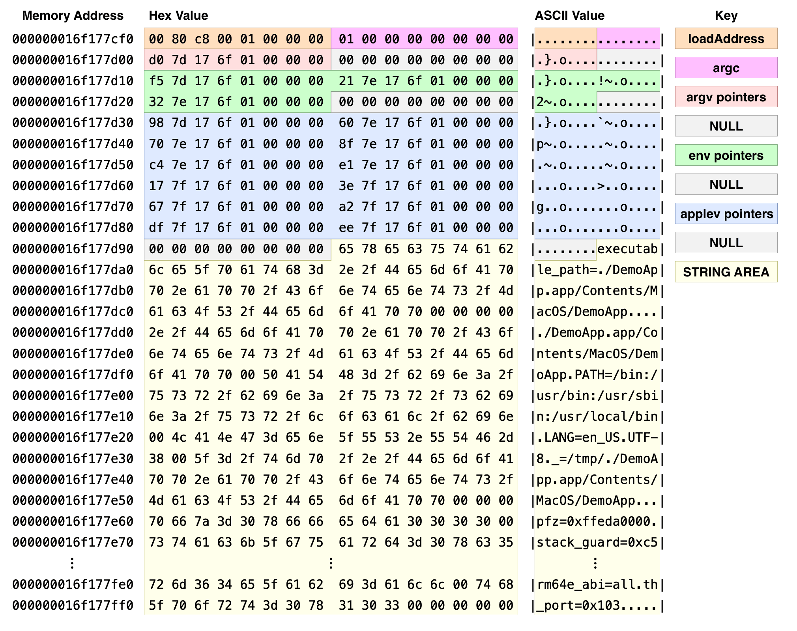
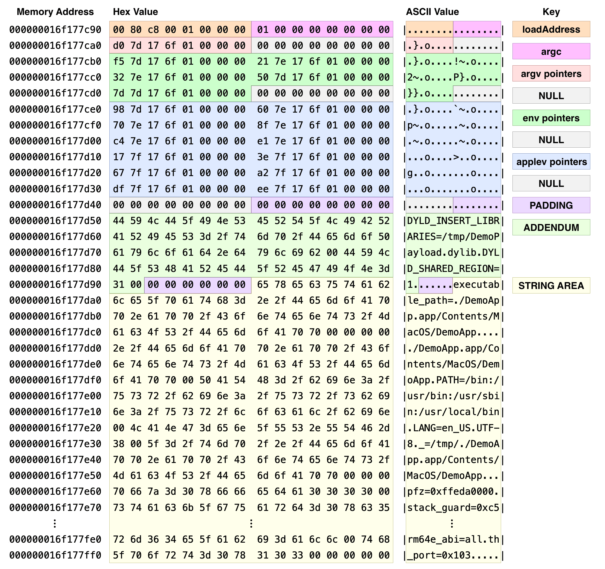
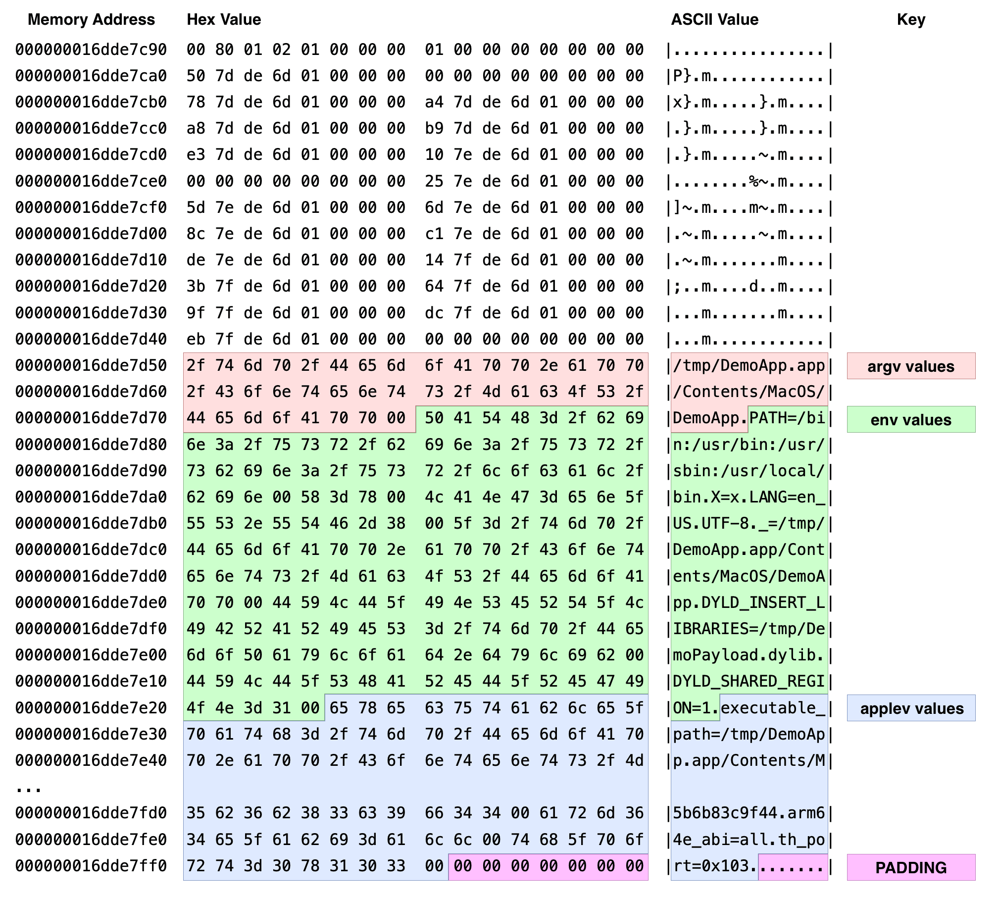

# ESInjectorDemo

This is an example project to demonstrate macOS code injection via a combination of the [Endpoint Security framework](https://developer.apple.com/documentation/endpointsecurity?language=objc), `task_for_pid()`, and `DYLD_INSERT_LIBRARIES`.

This is not my original idea. Full credit goes to [Saagar Jha](https://github.com/saagarjha) for his [library_injector.cpp gist](https://gist.github.com/saagarjha/a70d44951cb72f82efee3317d80ac07f) and to [Jevin Sweval](https://github.com/jevinskie) for [es-injector](https://github.com/jevinskie/es-injector). While this demo is heavily based on Saagar's gist, I rewrote it to use pure C and Objective-C rather than modern STL-based C++.

Other notable changes:

- I use `vm_region_64()` to fetch the memory region allocated to the remote process's stack. I then copy the contents from `sp` to the end of this region into a local buffer. This prevents calling `vm_read_overwrite` to fetch single bytes.
- I align `sp` to a 16-byte boundary in my `sWriteStack()` function, as Saagar suggests in his gist. This frees up 4 bytes when patching `_dyld_start`.

#### Hardware Compatibility

This demo only targets the arm64 architecture, as I no longer own Intel hardware.

#### Software Compatibility

This demo was developed on macOS Sonoma. While it should work on macOS Sequoia, I haven't personally tested it. I cannot guarantee compatibility with newer versions of macOS as Apple continues to lock down and enfeeble the platform.

All links to external repositories point to Sonoma-era tags.

## Preparation and Disclaimer

As with all forms of code injection, you will need to disable [System Integrity Protection](https://developer.apple.com/documentation/security/disabling-and-enabling-system-integrity-protection?language=objc) (SIP). With great power comes great responsibility – running with SIP disabled dramatically increases the number of attack vectors which can be used against you.

Additionally, you will need to disable Library Validation via the following Terminal command:

```text
sudo defaults write \
    /Library/Preferences/com.apple.security.libraryvalidation.plist \
    DisableLibraryValidation -bool true
```

> [!CAUTION]
> **By using the code in this repository, you agree to take full responsibility for your now-increased attack surface.**
> 
> In practice, this means: don't run software from untrusted sources, audit all dependencies installed by package managers, and monitor security feeds for major exploits.


#### Injection into System Binaries

System binaries on macOS use the `arm64e` architecture rather than `arm64` and use [pointer authentication](https://clang.llvm.org/docs/PointerAuthentication.html).

By default, this demo does not build for `arm64e`. To use the injector with system binaries, you will need to do the following:

1. Enable the `arm64e_preview_abi` boot arg via:
`sudo nvram boot-args="-arm64e_preview_abi"`
2. Add `-arch arm64e` to the compiler flags for the injector and your payload dylib.


## Project Targets

The Xcode project includes three targets:

| Name | Description |
| - | - |
| DemoApp | An application which draws three boxes to its Dock icon and then terminates. Upon successful injection of DemoPayload, all three boxes should be green. If injection failed, one or more of the boxes will be red.
| DemoPayload | A dylib that will be injected (via `DYLD_INSERT_LIBRARIES`) into DemoApp. This interposes and swizzles various functions/methods to make DemoApp draw green boxes.
| Injector | The actual injector, must be ran as `root`. |

By default, the project is configured to build all targets and run "Injector" as root.

You can also invoke Injector from the command line as follows:

```text
sudo /path/to/Injector /path/to/DemoPayload.dylib DemoApp
```

In both cases, you will need to run DemoApp manually. In testing, I found it valuable to pin DemoApp to my Dock so I could re-launch it as necessary.


## Methodology

Our goal is to add the `DYLD_INSERT_LIBRARIES=/path/to/DemoPayload.dylib` environment variable to the DemoApp process and let `dyld` perform the actual injection/interposing.

We will also need to set the `DYLD_SHARED_REGION=1` to disable "dyld-in-cache".

We will use the [Endpoint Security framework](https://developer.apple.com/documentation/endpointsecurity?language=objc) to register for the `ES_EVENT_TYPE_AUTH_EXEC` event. This will prevent any execution in the newly-spawned process until we respond with `ES_AUTH_RESULT_ALLOW`.


### Modifying the Stack

Before launch, the kernel allocates a region of memory to be used as the stack space for the main thread. It then places program arguments, environment variables, and platform-specific variables at the end of this region. The stack pointer (SP) is placed before this area and moves towards memory address `0x0` as the stack grows.

In visual form:



We are interested in the purple area, which was configured in `exec_mach_imgact()` in [kern_exec.c](https://github.com/apple-oss-distributions/xnu/blob/xnu-10063.141.1/bsd/kern/kern_exec.c).

Starting from the stack pointer, it contains:

1. `loadAddress`
2. `argc` as a 64-bit value
3. X pointers to the `argv[]` strings, where X is `argc`.
4. `0`/`NULL` as a 64-bit value
5. X pointers to the `env[]` strings
6. `0`/`NULL` as a 64-bit value
7. X pointers to the `applev[]` strings
8. `0`/`NULL` as a 64-bit value
9. The "String Area", which contains the actual NULL-terminated string values.

In visual form:



The string area is a bit messy. It has evolved over time and is filled across various kernel functions (`exec_copyout_strings()`, `exec_add_user_string()`, `exec_save_path()`, etc.). Various sub-areas have been aligned with padding, and `applev[0]` ends up prepended before `argv[0]`:


---

We need to do the following:

- Modify the string area to add our `DYLD_INSERT_LIBRARIES` and `DYLD_SHARED_REGION` environment variables.
- Add pointers to `envp[]` for the added variables.

Unfortunately, as the stack grows "downward" towards `0x0` and we have very little room in the string area, any additions will invalidate all pointers. Hence, we need to reshuffle and rewrite everything.

> [!NOTE]  
> While the kernel adds alignment and padding bytes in various functions; in practice, we do not need to preserve these. We simply need to ensure that all pointers are aligned to 8-byte boundaries.

In the demo, `sReadStack()` parses the contents of the stack and builds a `Stack` structure. We add our new environmental variables to this structure in `sModifyStack()`. We then write the structure back to the stack in `sWriteStack()`.





Due to the added variables, our new stack pointer is `0x16dde7c90` instead of `0x16dde7ce0`, a difference of 80 bytes.

### Updating the Stack Pointer

Prior to macOS Sonoma 14.4, we could use `thread_set_state()` to update the `sp` register. Unfortunately, Apple now prevents this (*sigh*).

Saagar works around this by patching `_dyld_start`, located in [dyldStartup.s](https://github.com/apple-oss-distributions/dyld/blob/dyld-1165.3/dyld/dyldStartup.s). The original arm64 assembly code of this function is as follows:

```asm

__dyld_start:
    mov  x0, sp        // get pointer to KernelArgs into parameter register
    and  sp, x0, #~15  // force 16-byte alignment of stack
    mov  fp, #0        // first frame
    mov  lr, #0        // no return address
    b    start
```

As Saagar notes, `fp` and `lr` are initialized to `0` by the kernel. This gives us 2 instructions worth of wiggle-room. Additionally, in `sModifyStack()`, we already align `sp` to a 16-byte boundary, giving us an extra instruction.

We need to move `sp` downwards by 80 bytes. To do this, we can simply replace the first two instructions:

```text
__dyld_start:
    sub sp, sp, #80
    mov x0, sp
    b   start
```

The [immediate version of sub](https://developer.arm.com/documentation/dui0802/b/A64-General-Instructions/SUBS--immediate-) takes a 12-bit number. This means that we can shift the stack a maximum of 4095 bytes. For 4096 or more bytes, we can use a second `sub` instruction with the "shift" flag set.

For example, if we wanted to move `sp` by 10000 bytes, we calculate the lower 12-bits and upper 12-bits of 10000 as follows:

```text
10000 & 0xfff = 1808
(10000 >> 12) & 0xfff = 2

(2 * (1 << 12)) + 1808 = 10000
```

We then use two `sub` instructions as follows:

```text
__dyld_start:
    sub sp, sp, #1808        //            1808
    sub sp, sp, #2, lsl #12  // 2 * 4096 = 8192
    b   start
```

Note that `pc` has been set by the kernel to point to `_dyld_start`, hence, all we need to do is calculate our patch and `vm_write` it to address specified by `arm_thread_state64_get_pc(state)`.


### Patching AMFI

Finally, we need to patch `amfi_check_dyld_policy_self()` in [dyld's glue.c](https://github.com/apple-oss-distributions/dyld/blob/dyld-1165.3/dyld/glue.c) to enable interposing (via the `AMFI_DYLD_OUTPUT_ALLOW_LIBRARY_INTERPOSING` flag).

Our new function should be:

```c
int amfi_check_dyld_policy_self(uint64_t input_flags, uint64_t* output_flags)
{
    *output_flags = 
        AMFI_DYLD_OUTPUT_ALLOW_AT_PATH             |
        AMFI_DYLD_OUTPUT_ALLOW_PATH_VARS           |
        AMFI_DYLD_OUTPUT_ALLOW_CUSTOM_SHARED_CACHE |
        AMFI_DYLD_OUTPUT_ALLOW_FALLBACK_PATHS      |
        AMFI_DYLD_OUTPUT_ALLOW_PRINT_VARS          |
        AMFI_DYLD_OUTPUT_ALLOW_LIBRARY_INTERPOSING;

    return 0;
}
```

In arm64 form:

```text
mov x2, #0x5f  // Move #0x5f into x2 scratch register
str x2, [x1]   // Store x2 into *output_flags
mov x0, #0     // Store #0 into x0 (return value)
ret            // Do return
```

To make this change, we need to figure out the memory location of `_amfi_check_dyld_policy_self`. To do so:

1. Get the injected process's `TASK_DYLD_INFO`.
2. Iterate through each load command.
3. If the command is a `LC_SYMTAB`, iterate through each symbol.
4. Find the symbol value of `__dyld_start` and `_amfi_check_dyld_policy_self`.

Since our program counter (`pc` register) points to the start of `__dyld_start` in the remote address space, we can calculate the correct address of `_amfi_check_dyld_policy_self` via:

```text
actual_amfi_check_dyld_policy_self =
    pc + (symtab_amfi_check_dyld_policy_self - symtab_dyld_start)
```

`sWriteAMFICheckPolicyPatch()` then writes our patch to this address and enables interposing.

## License

The contents of this repository are heavily based on [Saagar Jha's gist](https://gist.github.com/saagarjha/a70d44951cb72f82efee3317d80ac07f) and therefore are licensed under the [GNU Lesser General Public License, Version 3.0](https://www.gnu.org/licenses/lgpl-3.0.en.html).

While I normally only care about proper attribution in source code (not binary form), please follow Saagar Jha's wishes and give him credit in both.

`SPDX-License-Identifier: LGPL-3.0-only`
